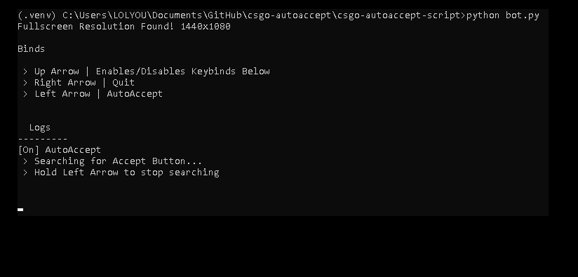

<div align="center">
	<h1>
		<br>
		<a href="https://github.com/scogliera/csgo-autoaccept/">
			
		</a>
		</br>
  <div>
    
  </div>
	</h1>
	<h4>A simple script that looks for the Accept button and clicks on it when found</h4>
<br><br>
</div>

## Notes
* **You must have CS:GO running before starting the script**
* If you're using the **Python Script instead of the Application**, you must have **Python 3 installed**
* For the **automatic script setup (.bat)**, you must have **Python 3 installed in the default location** (**...\AppData\Local\Programs\Python**)
<br><br><br>

## Usage
- **Make sure that CS:GO is already running before starting the script!**
- After starting the script, **wait for it to open up CS:GO in the taskbar**
- When it opens up CS:GO, it will try to find your resolution (if you're using fullscreen stretched)
1. **One beep** => The monitor's resolution didn't change, **script will use your Desktop resolution**
2. **Two beeps** => Fullscreen Stretched resolution detected, **script will use your in-game resolution**
- At this point, everything is set up and ready for use
- See the console window for binds
<p align="center">
  
  <br><br><br>
</p>


## Installation
### Application (.exe)
> This is the best choice for **ease of instalation**.

* Download the "**csgo-autoaccept-setup.exe**" file
<p align="center">
	<a href="https://github.com/scogliera/csgo-autoaccept/releases/download/v1.1.0/csgo-autoaccept-setup.exe">
		
	</a>
</p>

* Once you start the setup, **Windows Smartscreen will probably show a warning**, since Windows doesn't know who created the program
* To continue, press **More info** and **Run Anyway**
* In the setup, enter the folder you want the script to install into, and wait for the installation to finish
* After that, you're finished! Go into the folder where you installed the script and run **bot.exe**!


### Python Script
> This is the best choice for **speed** and **reliability**.
* To use the Python Script, download the "**csgo-autoaccept-script.zip**" file
<p align="center">
	<a href="https://github.com/scogliera/csgo-autoaccept/releases/download/v1.1.0/csgo-autoaccept-script.zip">
		
	</a>
</p>

* Extract the contents of the .zip file

#### Automatic Installation (.bat)
> To use the Automatic Installation method, **you must have Python 3 installed in the default location** (**...\AppData\Local\Programs\Python**)
* Run the setup.bat file and wait until the command prompt disappears
* **After that, you're set! Just run AutoAccept.bat whenever you want to start AutoAccept!**


#### Manual Installation
* Open up cmd in the **csgo-autoaccept-script** folder (An easy way to do so is by entering **cmd** in the address bar)

<p align="center">
  
</p>

* Create a venv
1. Locate your python installation folder. By default in: **C:\Users\user\AppData\Local\Programs\Python\Python3.x\python.exe**
2. Copy the full address **ending with \python.exe**
3. In the cmd window opened up earlier, type:
```<full copied address> -m venv .venv```
* Enter the venv by entering: 
```.venv\Scripts\activate.bat```
* Download the required dependencies by entering: 
```pip install -r requirements.txt```
* After that, you're set up! Close the command prompt and start the **AutoAccept.bat** file
